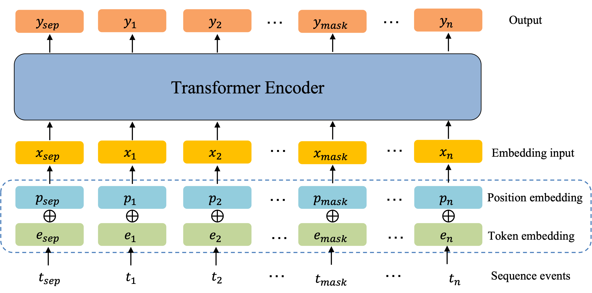

# EHR-BERT: Anomaly Detection in Electronic Health Records using BERT

This repository provides the implementation of Bert for sequence anomaly detection. EHR-BERT is a comprehensive library designed for effective anomaly detection in Electronic Health Records (EHRs). This versatile toolkit incorporates state-of-the-art techniques and deep learning models, specifically tailored for processing sequential medical data. With EHR-BERT, you gain access to a wide range of features and capabilities:

- **Diverse Anomaly Detection Methods**: The repo encompasses a collection of dynamic and temporal anomaly detection methods inspired by cutting-edge research papers. These methods are modified to excel in identifying anomalies within complex EHR sequences.

- **Effortless GPU Acceleration**: EHR-BERT seamlessly leverages GPU resources, enabling accelerated training and evaluation of anomaly detection models. Harness the power of GPUs to process large EHR datasets efficiently.

- **Discover the potential of EHR-BERT for robust anomaly detection in Electronic Health Records**: With its rich feature set and integration with PyTorch Lightning, you can confidently tackle anomaly detection challenges in medical data. Explore the introductory example to see how EHR-BERT can be used effectively to enhance your anomaly detection workflows.



## Prerequisites

Before using this code, make sure you have the following prerequisites installed on your system:

- Ubuntu 20.04
- NVIDIA driver 460.73.01
- CUDA 11.2
- Python 3.8
- PyTorch 1.9.0

## Installation

To set up the required environment, follow these steps:

1. Clone the repository.
2. Create a Conda environment using the provided YAML file:

   ```shell script
   conda env create -f ./environment/environment.yml
   conda activate ehr-bert
    ```

Reference: https://docs.conda.io/en/latest/miniconda.html

## Running Experiments with Sample Data

We provide preprocessed synthetic sequence data files for testing in [example](https://github.com/hniu1/EHR-BERT/tree/main/output/example). [sequences](https://github.com/hniu1/EHR-BERT/blob/main/output/example/sequences) contains all the sequences for testing where each number represents an unique event. [train](https://github.com/hniu1/EHR-BERT/blob/main/output/example/train), [test_normal](https://github.com/hniu1/EHR-BERT/blob/main/output/example/test_normal) and [test_abnormal](https://github.com/hniu1/EHR-BERT/blob/main/output/example/test_abnormal) provide processed data for training and testing.
The following steps are provided for testing the example data.

### Pretrain

```shell script
cd Bert

#run bert pretraining
python ehr-bert.py vocab
python ehr-bert.py train

```

### Testing

```shell script
cd Bert

#run bert prediction
python ehr-bert.py predict

```

### Folders created during execution

```shell script
project/output //Stores intermediate files and final results during execution
```

## Paper

```plaintext
@article{niu2024ehr,
  title={EHR-BERT: A BERT-based model for effective anomaly detection in electronic health records},
  author={Niu, Haoran and Omitaomu, Olufemi A and Langston, Michael A and Olama, Mohammad and Ozmen, Ozgur and Klasky, Hilda B and Laurio, Angela and Ward, Merry and Nebeker, Jonathan},
  journal={Journal of Biomedical Informatics},
  pages={104605},
  year={2024},
  publisher={Elsevier}
}
